# Maven: AI-Powered Product Research Assistant, Data Driven Purchase

## See the [Maven](https://maven-ai-six.vercel.app/) (live preview) deployed on [Vercel](https://vercel.com)

_🚨 URGENT NOTICE: This Developer Urgently Needs a Job ASAP! 🚨_

[](https://opensource.org/licenses/MIT)

**Maven** is a cutting-edge web application that leverages the power of Artificial Intelligence to revolutionize **electronic categorized product** research and decision-making. It provides users with a suite of tools to find, understand, and compare products, all within a streamlined and intuitive interface. Maven combines natural language processing, web scraping, external API integrations, and advanced AI models to deliver personalized recommendations, detailed product information, side-by-side comparisons, and insightful summaries.

## Snapshots, See the App in action [Here](https://ac1wy0nbjb.ufs.sh/f/UTUjFq2sQuvaBc2SlHG6QdwImq0NPrCg3yuKpnjbJkeUxfZi)


## Table of Contents

- [Maven: AI-Powered Product Research Assistant, Data Driven Purchase](#maven-ai-powered-product-research-assistant-data-driven-purchase)
  - [See the Maven (live preview) deployed on Vercel](#see-the-maven-live-preview-deployed-on-vercel)
  - [Snapshots, See the App in action Here](#snapshots-see-the-app-in-action-here)
  - [Table of Contents](#table-of-contents)
  - [1. Features ](#1-features-)
  - [2. Technology Stack ](#2-technology-stack-)
  - [3. Project Structure ](#3-project-structure-)
  - [4. Getting Started ](#4-getting-started-)
    - [4.1. Prerequisites ](#41-prerequisites-)
    - [4.2. Installation ](#42-installation-)
    - [4.3 SQL Table](#43-sql-table)
    - [4.3. Environment Variables ](#43-environment-variables-)
    - [4.4. Running the Application ](#44-running-the-application-)
  - [5. Usage ](#5-usage-)
    - [5.1. Basic Interaction ](#51-basic-interaction-)
    - [5.2. Agent Tools ](#52-agent-tools-)
      - [5.2.1. `recommendator` ](#521-recommendator-)
      - [5.2.2. `searchProduct` ](#522-searchproduct-)
      - [5.2.3. `getProductDetails` ](#523-getproductdetails-)
      - [5.2.4. `productsComparison` ](#524-productscomparison-)
      - [5.2.5. `inquireUser` ](#525-inquireuser-)
  - [6. Deployment ](#6-deployment-)
  - [7. Contributing ](#7-contributing-)
  - [8. License ](#8-license-)
  - [9. Troubleshooting ](#9-troubleshooting-)
  - [10. Application Workflow Diagram](#10-application-workflow-diagram)

## 1. Features <a name="features"></a>

Maven offers a comprehensive set of AI-powered features designed to assist users throughout the product research process:

- **Personalized Recommendations (`recommendator`):** Get product suggestions tailored to your specific needs and preferences. Maven analyzes your input and provides insightful explanations for each recommendation.
- **Precise Product Search (`searchProduct`):** Quickly find specific products using full or partial names. Maven retrieves relevant results and presents them with concise summaries.
- **In-Depth Product Details (`getProductDetails`):** Access comprehensive information about a product, including specifications, features, reviews, pricing, and availability. Maven gathers data from multiple sources, including web scraping and external APIs.
- **Side-by-Side Comparisons (`productsComparison`):** Compare two products directly, highlighting key differences and similarities. Maven provides AI-powered insights to help you evaluate the options.
- **Interactive Inquiry (`inquireUser`):** Maven proactively asks clarifying questions to ensure it fully understands your needs, leading to more accurate and personalized results.
- **Streamed Results:** Experience a responsive and interactive interface with results delivered progressively as they become available.
- **Related Queries:** Explore alternative products and refine your search with suggested related queries.
- **AI-Powered Insights:** Understand the reasoning behind recommendations and comparisons with concise, informative explanations.

## 2. Technology Stack <a name="technology-stack"></a>

Maven is built using a modern and robust technology stack:

- **Framework:** Next.js (React) - Provides server-side rendering, routing, and a component-based architecture.
- **Language:** TypeScript - Adds static typing to JavaScript, improving code quality and maintainability.
- **AI Models:**
  - Google Generative AI (Gemini) - Used for natural language processing, text generation, and object generation.
  - (Optional) Groq, xAI, DeepSeek - Alternative AI models for potential performance or feature enhancements.
- **Web Scraping:** Firecrawl - Used to extract data from web pages.
- **External APIs:**
  - Tavily - Used for enhanced search and information retrieval.
  - Serper - Alternative search API.
- **Database:**
  - Upstash Redis - Used for caching and session management.
  - Neon (PostgreSQL) - Used for persistent data storage (e.g., user accounts, chat history).
- **Authentication:** NextAuth.js - Handles user authentication with providers like GitHub and Google.
- **Styling:** Shadcn/UI, Tailwindcss, Sass.
- **Deployment:** Vercel.
- **State Management:** `ai/rsc` - For stream UI, managing AI and UI state.

## 3. Project Structure <a name="project-structure"></a>

The codebase follows a well-organized structure. Key directories and files include (these are representative, it might be different from real source tree):

```
maven/
├── @/components/         # UI Components (React components)
│   └── maven/          # Specific components related to Maven features
│       ├── assistant-message/ # Component for displaying assistant messages
│       ├── error-message/     # Component for displaying error messages
│       ├── extended-message/  # Component for displaying extended messages
│       ├── product-comparison/# Component for product comparisons
│       ├── product-details/   # Component for displaying product details
│       ├── product-search/    # Component for product search results
│       ├── recommendation-action/ # Component for recommendation actions
│       ├── recommendation-skeleton/ # Skeleton loading component for recommendations
│       ├── related-message/   # Component for displaying related messages
│       ├── shining-glass/     # (Likely a custom loading or visual component)
│       ├── user-inquiry/      # Component for user inquiries
│       └── user-inquiry-skeleton/ # Skeleton loading component for user inquiries
├── @/lib/                # Core application logic and utilities
│   ├── agents/           # Logic related to AI agents and tools
│   │   ├── action/       # Actions and mutations related to agent tools
│   │   │   ├── mutator/  # Functions for mutating the AI state
│   │   │   └── ...
│   │   ├── constant/     # Constants used by the agents
│   │   ├── schema/       # Data schemas for validation and type safety
│   │   ├── tools/        # API integrations for external services
│   │   └── ...
│   ├── service/          # Services for interacting with databases and external APIs
│   ├── types/            # TypeScript type definitions
│   ├── utility/          # Utility functions
│   └── ...
├── @/app/                # Next.js pages and API routes
│   ├── (route)/          # Route groups
│   │   ├── features/     # The /features route (feature list)
│   │   ├── workflow/     # The /workflow route (workflow documentation)
│   │   └── cookbook/     # The /cookbook route (user guide)
│   ├── api/              # API endpoints
│   └── ...
├── public/               # Static assets (images, fonts, etc.)
├── .env.local            # Local environment variables (should NOT be committed)
├── next.config.js        # Next.js configuration
├── package.json          # Project dependencies and scripts
├── tsconfig.json         # TypeScript configuration
└── README.md             # This file
```

## 4. Getting Started <a name="getting-started"></a>

### 4.1. Prerequisites <a name="prerequisites"></a>

Before you begin, ensure you have the following installed:

- **Node.js:** (v18 or later recommended) - JavaScript runtime environment.
- **NPM:** (or yarn, or pnpm) - Package manager for Node.js.
- **Git:** Version control system.
- **A code editor:** (VS Code, Sublime Text, Atom, etc.)

### 4.2. Installation <a name="installation"></a>

1.  **Clone the repository:**

    ```bash
    git clone https://github.com/rizzzky78/market-maven
    cd market-maven
    ```

2.  **Install dependencies:**

    ```bash
    bun install
    # or
    yarn install
    # or
    pnpm install
    ```

### 4.3 SQL Table

Paste bellow SQL query to create database table on Neon database SQL query editor:

- scrape_cache Table

```sql
CREATE TABLE scrape_cache (
    key UUID PRIMARY KEY,
    query TEXT NOT NULL,
    response JSONB NOT NULL,
    created_at TIMESTAMP WITH TIME ZONE DEFAULT CURRENT_TIMESTAMP
);

-- Optional: Add an index on query for faster lookups
CREATE INDEX idx_scrape_cache_query ON scrape_cache (query);
```

**Description:** Stores cached web scraping results with a UUID primary key. Each record contains a query string, JSON response data, and a timestamp. Designed for quick lookups of previously scraped content to avoid redundant web requests.

- markdown_store Table

```sql
CREATE TABLE markdown_store (
    key TEXT PRIMARY KEY,
    chat_id TEXT NOT NULL,
    owner TEXT NOT NULL,
    type TEXT NOT NULL,
    markdown TEXT NOT NULL,
    timestamp TIMESTAMP WITH TIME ZONE DEFAULT CURRENT_TIMESTAMP
);

-- Optional: Add indexes for faster lookups
CREATE INDEX idx_markdown_store_chat_id ON markdown_store (chat_id);
CREATE INDEX idx_markdown_store_owner ON markdown_store (owner);
```

**Description:** Stores markdown content with metadata. Used to persist formatted text content related to products or other entities. Each entry is identified by a unique key and associated with a specific chat and owner.

- object_store Table

```sql
CREATE TABLE object_store (
    key TEXT PRIMARY KEY,
    chat_id TEXT NOT NULL,
    owner TEXT NOT NULL,
    type TEXT NOT NULL,
    object JSONB NOT NULL,
    timestamp TIMESTAMP WITH TIME ZONE DEFAULT CURRENT_TIMESTAMP
);

-- Optional: Add indexes for faster lookups
CREATE INDEX idx_object_store_chat_id ON object_store (chat_id);
CREATE INDEX idx_object_store_owner ON object_store (owner);
```

**Description:** General-purpose object storage table that maintains structured JSON data. Supports different object types (like product searches, product details, etc.) and associates each object with a chat and owner.

- tool_data_store Table

```sql
CREATE TABLE tool_data_store (
    key TEXT PRIMARY KEY,
    chat_id TEXT NOT NULL,
    owner TEXT NOT NULL,
    tool_success BOOLEAN NOT NULL,
    tool_name TEXT NOT NULL,
    tool_args JSONB NOT NULL,
    tool_data JSONB NOT NULL,
    timestamp TIMESTAMP WITH TIME ZONE DEFAULT CURRENT_TIMESTAMP
);

-- Optional: Add indexes for faster lookups
CREATE INDEX idx_tool_data_store_chat_id ON tool_data_store (chat_id);
CREATE INDEX idx_tool_data_store_owner ON tool_data_store (owner);
```

**Description:** Records the results of tool operations with detailed tracking of success status. Stores both the input arguments and output data as JSON, making it useful for auditing and retrieving past tool executions.

- shares Table

```sql
CREATE TABLE shares (
    id TEXT PRIMARY KEY,
    user_id TEXT,
    user_email TEXT NOT NULL,
    reference_id TEXT UNIQUE NOT NULL,
    component_id TEXT NOT NULL,
    component_type TEXT NOT NULL,
    created_at TIMESTAMP WITH TIME ZONE DEFAULT CURRENT_TIMESTAMP,
    last_accessed_at TIMESTAMP WITH TIME ZONE DEFAULT CURRENT_TIMESTAMP,
    access_count INTEGER DEFAULT 0
);

-- Optional: Add indexes for faster lookups
CREATE INDEX idx_shares_reference_id ON shares (reference_id);
CREATE INDEX idx_shares_user_id ON shares (user_id);
CREATE INDEX idx_shares_component_type ON shares (component_type);
```

**Description:** Manages content sharing functionality. Tracks when components are shared, who shared them, access counts, and last access times. Supports analytics on sharing patterns across different component types.

### 4.3. Environment Variables <a name="environment-variables"></a>

Create a `.env.local` file in the root directory of the project and populate it with the necessary environment variables. **Do not commit this file to version control.** You'll need to obtain API keys and database credentials from the respective services.

```
LOG_LEVEL="info"

# Base URL search for Tokopedia (or other e-commerce site, if applicable)
TOKOPEDIA_SEARCH_BASE_URL="https://www.tokopedia.com/search?q="

# Models
# Google Generative AI API key retrieved here: https://aistudio.google.com/app/apikey
GOOGLE_GENERATIVE_AI_API_KEY="YOUR_APIKEY"

# Groq API key retrieved here: https://console.groq.com/keys
GROQ_API_KEY="YOUR_APIKEY"

XAI_API_KEY="YOUR_APIKEY"

DEEPSEEK_API_KEY="YOUR_APIKEY"

# External Sources API

# Tavily API Key retrieved here: https://app.tavily.com/home
TAVILY_API_KEY="YOUR_APIKEY"

# Serper API Key retrieved here: https://serper.dev/api-key
SERPER_API_KEY="YOUR_APIKEY"

FIRECRAWL_API_KEY="YOUR_APIKEY"

# Databases

# Upstash Redis URL and Token retrieved here: https://console.upstash.com/redis
UPSTASH_REDIS_REST_URL="YOUR_APIKEY"
UPSTASH_REDIS_REST_TOKEN="YOUR_APIKEY"

NEON_DATABASE_URL="YOUR_APIKEY" # PostgreSQL connection string

NEXTAUTH_SECRET="USE_SECURE_STRING_OR_RANDSSL" # Generate a strong secret
NEXTAUTH_URL=http://localhost:3000 # Update this for production

AUTH_GITHUB_ID="YOUR_GITHUB_AUTH_ID"
AUTH_GITHUB_SECRET="YOUR_GITHUB_AUTH_SECRET"

AUTH_GOOGLE_ID="YOUR_GOOGLE_AUTH_ID"
AUTH_GOOGLE_SECRET="YOUR_GOOGLE_AUTH_SECRET"

# Redis Configuration
USE_LOCAL_REDIS=false
LOCAL_REDIS_URL=redis://localhost:6379 # or redis://redis:6379 if you're using docker compose

# Must change when on production
NEXT_PUBLIC_APP_URL=http://localhost:3000
```

**Important Notes on Environment Variables:**

- **Security:** Never commit your `.env.local` file to version control. It contains sensitive API keys and credentials.
- **API Keys:** You'll need to sign up for accounts with the various services (Google Generative AI, Groq, Tavily, Serper, Firecrawl, Upstash Redis, Neon) to obtain API keys.
- **Database URLs:** The `NEON_DATABASE_URL` is a PostgreSQL connection string. You'll need to set up a PostgreSQL database (e.g., using Neon) and obtain the connection string.
- **Authentication:** You'll need to configure authentication providers (GitHub, Google) and obtain client IDs and secrets.
- `NEXTAUTH_SECRET`: Use openssl to generate it. `openssl rand -base64 32`
- **`NEXT_PUBLIC_APP_URL`:** Change this to your production URL when deploying.

### 4.4. Running the Application <a name="running-the-application"></a>

1.  **Start the development server:**

    ```bash
    bun run dev
    # or
    yarn dev
    # or
    pbun dev
    ```

2.  **Open your browser and navigate to `http://localhost:3000`** (or the URL indicated in the console).

## 5. Usage <a name="usage"></a>

### 5.1. Basic Interaction <a name="basic-interaction"></a>

The primary interface for interacting with Maven is a chat-like input field. You can:

- **Type text queries:** Ask questions or make requests related to products.
- **Interact with prompts:** Respond to clarifying questions from Maven.
- **Attach Product:** Send existing product to get recommendation based on it.
- **Compare Product:** Compare two products.

Maven will process your input and respond with relevant information, recommendations, or comparisons. The results are streamed, meaning you'll see information appear as it becomes available.

### 5.2. Agent Tools <a name="agent-tools"></a>

Maven utilizes a set of AI-powered agent tools to fulfill user requests. These tools are automatically selected by the orchestrator based on the user's intent.

#### 5.2.1. `recommendator` <a name="recommendator"></a>

- **Purpose:** Provides personalized product recommendations.
- **Input:** A text query describing your needs and preferences (e.g., "best noise-canceling headphones for travel under $200").
- **Output:** A list of recommended products, along with AI-powered insights explaining the recommendations.
- **Example:**
  ```
  User: I need a new laptop for graphic design and video editing. My budget is around $2000.
  Maven: (Provides a list of recommended laptops with insights)
  ```

#### 5.2.2. `searchProduct` <a name="searchproduct"></a>

- **Purpose:** Finds specific products based on their names (full or partial).
- **Input:** The full or partial name of the product (e.g., "Sony WH-1000XM5", "WH-1000XM").
- **Output:** A list of matching products, with concise summaries and links to more details.
- **Example:**
  ```
  User: Samsung Galaxy S23 Ultra
  Maven: (Provides search results for the Samsung Galaxy S23 Ultra)
  ```

#### 5.2.3. `getProductDetails` <a name="getproductdetails"></a>

- **Purpose:** Retrieves comprehensive information about a specific product.
- **Input:** The product name or a link to the product page.
- **Output:** Detailed product specifications, features, reviews, pricing, and availability information, along with AI-powered insights.
- **Example:**
  ```
  User: Attach selected product on UI and submit message attach product or along with text inputs
  Maven: (Provides detailed information about the iPhone 15 Pro plus insight)
  ```

#### 5.2.4. `productsComparison` <a name="productscomparison"></a>

- **Purpose:** Compares two products side-by-side.
- **Input:** The `callId` values of two products (obtained after using `getProductDetails` on each product).
- **Output:** A comparison table highlighting key differences and similarities, along with AI-powered insights.
- **Example:**
  ```
  User: Compare callId: a1b2c3d4 and callId: e5f6g7h8  (These are example IDs)
  Maven: (Provides a comparison table and insights)
  ```
  **Important:** You _must_ use `getProductDetails` on each product _before_ you can compare them. This provides Maven with the necessary data.

#### 5.2.5. `inquireUser` <a name="inquireuser"></a>

- **Purpose:** Asks clarifying questions to ensure Maven fully understands your needs.
- **Input:** An ambiguous or incomplete user query.
- **Output:** A clarifying question presented to the user.
- **Example:**
  ```
  User: Find me a good laptop.
  Maven: What will you primarily use the laptop for? (Work/Productivity, Gaming, Creative Tasks, General Use, Other)
  ```

## 6. Deployment <a name="deployment"></a>

Deployment instructions will vary depending on your chosen platform (Vercel, Netlify, AWS, etc.). General steps include:

1.  **Set up a production database:** Configure your PostgreSQL database (e.g., on Neon) and Upstash Redis instance for production use.
2.  **Configure environment variables:** Set the appropriate environment variables on your deployment platform (including API keys and database credentials). **Do not commit sensitive information to your Git repository.**
3.  **Build the application:** Run `bun run build` (or the equivalent command for your package manager) to create a production build.
4.  **Deploy:** Follow the deployment instructions for your chosen platform.

## 7. Contributing <a name="contributing"></a>

Contributions are welcome! Please follow these guidelines:

1.  Fork the repository.
2.  Create a new branch for your feature or bug fix: `git checkout -b feature/your-feature-name`
3.  Make your changes and commit them with clear, descriptive messages.
4.  Push your branch to your forked repository.
5.  Submit a pull request to the main repository.

## 8. License <a name="license"></a>

This project is licensed under the MIT License - see the [LICENSE](LICENSE) file for details.

## 9. Troubleshooting <a name="troubleshooting"></a>

- **App isn't starting:**
  - Double check all environment variables, especially database connection strings and API keys.
  - Ensure all required services (PostgreSQL, Redis) are running and accessible.
  - Look for error messages in the console.
- **Features not working as expected:**
  - Review the Usage section of this README.
  - Check the browser's developer console for errors.
  - Ensure you have the correct API keys and that they are configured correctly.
- **Authentication issues:**
  - Verify your authentication provider settings (GitHub, Google) are correct.
  - Ensure `NEXTAUTH_URL` is set correctly for your environment.
- **Database connection problems:**
  - Double-check your database connection strings in `.env.local`.
  - Ensure your database server is running and accessible.
  - Verify that your database user has the necessary permissions.

## 10. Application Workflow Diagram

```mermaid
graph TD
    %% Main user entry point
    A["User Input (Text/Data)"] --> B{"Orchestrator"}

    %% Core orchestration logic
    B --> C{"Determine Intent & Tool"}
    C --> D["Select Agent Tool"]

    %% Tool selection branches
    D --> E["recommendator"]
    D --> F["searchProduct"]
    D --> G["getProductDetails"]
    D --> H["productsComparison"]
    D --> I["inquireUser"]

    %% Recommendator flow
    subgraph "recommendator Flow"
        E --> E1["Generate Recommendations (streamObject)"]
        E1 --> E2["Generate Insights (streamText)"]
        E2 --> E3["Mutate State"]
        E3 --> E4{"Related Queries?"}
        E4 -- "Yes" --> E5["Generate Related Queries (streamObject)"]
        E4 -- "No" --> E6["Return UI"]
        E5 --> E6
        E --> E_Error["Handle Errors"]
        E_Error --> K["Error Handling"]
    end

    %% Search Product flow
    subgraph "searchProduct Flow"
        F --> F1["Scrape Data (handleScrapingWithCache, scrapeUrl)"]
        F1 --> F2["Extract Products (streamObject)"]
        F2 --> F3["Generate Insights (streamText)"]
        F3 --> F4["Mutate State"]
        F4 --> F5{"Related Queries?"}
        F5 -- "Yes" --> F6["Generate Related Queries (streamObject)"]
        F5 -- "No" --> F7["Return UI"]
        F6 --> F7
        F --> F_Error["Handle Errors (Scrape/LLM)"]
        F_Error --> K
    end

    %% Get Product Details flow
    subgraph "getProductDetails Flow"
        G --> G1["Scrape Data (handleScrapingWithCache, scrapeUrl)"]
        G1 --> G2{"External Search?"}
        G2 -- "Yes" --> G3["Perform External Search (externalTavilySearch)"]
        G3 --> G4["Extract Product Details (streamObject - no-schema)"]
        G2 -- "No" --> G4
        G4 --> G5["Generate Insights (streamText)"]
        G5 --> G6["Mutate State"]
        G6 --> G7{"Related Queries?"}
        G7 -- "Yes" --> G8["Generate Related Queries (streamObject)"]
        G7 -- "No" --> G9["Return UI"]
        G8 --> G9
        G --> G_Error["Handle Errors (Scrape/LLM)"]
        G_Error --> K
    end

    %% Products Comparison flow
    subgraph "productsComparison Flow"
        H --> H1["Retrieve Product Data (getObjectEntry)"]
        H1 --> H2["Handle Database Errors"]
        H2 -- "Error" --> K
        H2 -- "Success" --> H3["Generate Comparison (streamObject - no-schema)"]
        H3 --> H4["Generate Insights (streamText)"]
        H4 --> H5["Mutate State"]
        H5 --> H6{"Related Queries?"}
        H6 -- "Yes" --> H7["Generate Related Queries (streamObject)"]
        H6 -- "No" --> H8["Return UI"]
        H7 --> H8
        H --> H_Error["Handle LLM Errors"]
        H_Error --> K
    end

    %% Inquire User flow
    subgraph "inquireUser Flow"
        I --> I1["Parse Input (inputInquirySchema)"]
        I1 --> I2["Handle Parsing Errors"]
        I2 -- "Error" --> K
        I2 -- "Success" --> I3["Generate Inquiry (streamObject)"]
        I3 --> I4["Mutate State"]
        I4 --> I5["Return UI"]
        I --> I_Error["Handle LLM Errors"]
        I_Error --> K
    end

    %% Centralized error handling
    subgraph "Error Handling"
        K["Display Error Message"] --> J["Return UI Components"]
    end

    %% Output flow for all paths
    E6 --> J
    F7 --> J
    G9 --> J
    H8 --> J
    I5 --> J

    %% Add styling classes
    classDef default fill:#f9f9f9,stroke:#333,stroke-width:1px
    classDef decision fill:#e1f5fe,stroke:#01579b,stroke-width:1px
    classDef process fill:#e8f5e9,stroke:#2e7d32,stroke-width:1px
    classDef error fill:#ffebee,stroke:#c62828,stroke-width:1px
    classDef input fill:#fff3e0,stroke:#e65100,stroke-width:1px
    classDef output fill:#f3e5f5,stroke:#6a1b9a,stroke-width:1px

    %% Apply classes to nodes
    class A input
    class B,C,E4,F5,G2,G7,H6 decision
    class E1,E2,E3,E5,F1,F2,F3,F4,F6,G1,G3,G4,G5,G6,G8,H1,H3,H4,H5,H7,I1,I3,I4 process
    class E_Error,F_Error,G_Error,H_Error,I_Error,K error
    class E6,F7,G9,H8,I5,J output
```


